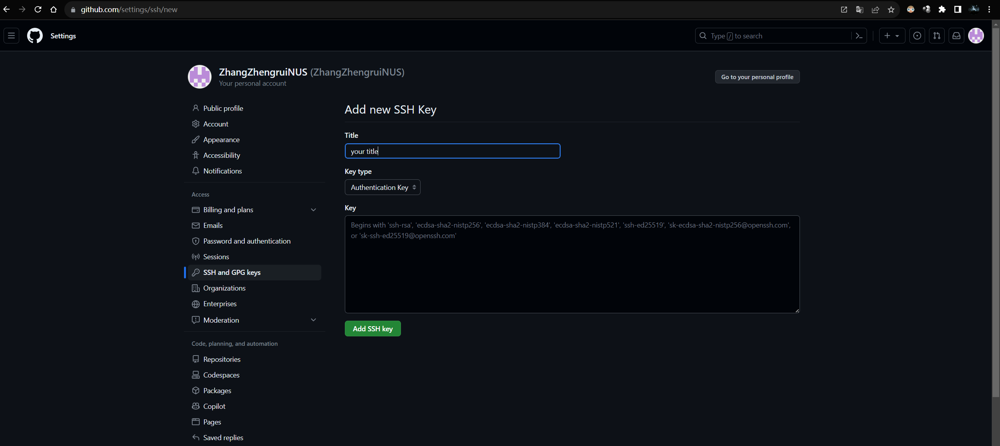

# Development instructions

>**Recommended development OS version: Ubuntu 22.04.3 LTS**
**For other OS, such as MacOS, some details may be different, please use Google/Chatgpt to solve it**

_Continuously updated..._

## 1. Install Git

- Enter the following code in the terminal

    ```bash
    sudo apt install git
    ```

- Set global name and mailbox

    ```bash
    git config --global user.name "Your Name"
    git config --global user.email "your_email@example.com"
    ```

    _Same as you registered on the Github website_

- Generate SSH public key

    _This step is not necessary, only for subsequent interaction with remote code libraries using the SSH protocol. You can also use the HTTP protocol, then you can skip this step, but it is recommended to use the SSH protocol because it has higher security and write permissions_

    ```bash
    ssh-keygen -t rsa -b 4096 -C "your_email@example.com"
    ```

    >Enter file in which to save the key (/home/your_user/.ssh/id_rsa)
        _Prompt for the save path and file name of the key file (by default, it will be saved in the~/. ssh directory)_
    Enter passphrase (empty for no passphrase)
        _Prompt for the password used to encrypt the private key (passphrase). You can choose not to set the password and simply **press Enter** to leave it blank_
    Enter same passphrase again
        _Prompt to confirm password. If a password is set, enter the same password again to confirm_

    View Public Key

    ```bash
    cd ~/.ssh # 进入ssh文件夹内
    cat id_rsa.pub # 查看公钥
    ```

    _Alternatively, use other file viewing tools such as VSCode_

    Copy Public Key(starts with 'ssh rsa', followed by a large string of characters)

    Enter the Github website, Settings ->SSH and GPG keys ->New SSH key

    

    Above is the title name, which can be set by yourself. Below is the place to paste your public key. Finally, clicking on Add SSH key.

## 2. Clone code

```bash
git clone git@github.com:ZhangZhengruiNUS/Red_Pocket_Game_Server.git
```

_If using the HTTP protocol, please modify the above command_

## 3. Use Git to start team development

### 3.1 Use branch to handle major changes

- When you want to start your current work for the first time, please create a new branch, and it is recommended to summarize and name it with the approximate work you will complete this time.

```bash
git checkout -b my-work
```

- If you are unsure of the current branch, please use the  following command to confirm

```bash
git branch
```

_All branches will be listed and marked with * next to the current branch_

- If the current branch is not the feature/my feature branch you created you are preparing to write code, please use the following command to switch to that branch

```bash
git checkout my-work
```

- When completing this stage of code writing, use the following command to add your changes to the local staging area

```bash
git add .
```

_This will add all modified files to the staging area. If you only want to add specific files, you can Replace "." with the file name._

- Submit your changes using the following command

```bash
git commit -m "A brief description of the work"
```

- Push to remote repository

```bash
git push origin my-work
```

- Pull request to merge branch

>Enter the GitHub repository page, open the Pull Request page, Click the "New Pull Request" button
Select the branch to merge
Compare changes
Fill in the modified information
Click the "Create Pull Request" button
Approve and merge the pull request on your own

### 3.2 Directly handle small changes in the main branch

>_Be cautious when making modifications on the main branch. Ensure that no other person is making changes that conflict with your changes at the same time._

- First, make sure you are on the main branch

```bash
git checkout main
```

- Get the latest code **(Important)**

```bash
git pull origin main
```

- When completing modification, use the following command to add your changes to the local staging area

```bash
git add .
```

- Before submitting, make sure again that your branch is up to date **(Important)**

```bash
git checkout main
git pull origin main
```

- Submit your changes using the following command

```bash
git commit -m "A brief description of the work"
```

- Push to remote repository

```bash
git push origin main
```

## 4. Development instruction

### 4.1 Server Development

### 4.2 Database 
